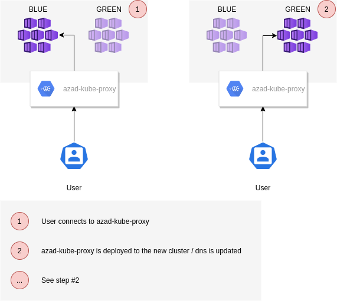

# azad-kube-proxy
Azure AD Kubernetes API Proxy

## Status

[](https://coveralls.io/github/XenitAB/azad-kube-proxy?branch=main)


## Charles the mascot


A turtle has a **shield** on the **back**, to protect it. A reverse proxy is a **shield** for the **back**end. Charles loves his **back**end and protects it with his **shield**.

*Created by [@cimcake](https://www.instagram.com/cimcake)*

## Description

This is a reverse proxy you place in front of your Kubernetes API. It will accept Azure AD access tokens (v2) and handle impersonation to the Kubernetes API.

A kubectl plugin (`kubectl azad-proxy`) can be used to handle authentication and configuration generation. It supports Azure CLI, environment variables and MSI as authentication source.

## Overview


## Installation

### Proxy (Helm chart)

Helm chart is located in [charts/azad-kube-proxy](charts/azad-kube-proxy) and published using GitHub Pages.

Example usage:

```shell
helm repo add azad-kube-proxy https://xenitab.github.io/azad-kube-proxy/
helm repo update

kubectl create namespace azad-kube-proxy
helm upgrade --namespace azad-kube-proxy --version <ver> --install azad-kube-proxy azad-kube-proxy/azad-kube-proxy
```

Example of using the Helm chart with Terraform can be found here (module): [github.com/XenitAB/terraform-modules//modules/kubernetes/azad-kube-proxy](https://github.com/XenitAB/terraform-modules/tree/main/modules/kubernetes/azad-kube-proxy)

### Plugin (Krew / kubectl plugin)

The kubectl plugin can be installed through Krew.

```shell
kubectl krew install azad-proxy
```

### Usage

### Proxy

Setup the proxy (using Helm Chart or other way). It is recommended to set it up using an ingress in front of it handling the TLS and also being able to take care of an allow list of what IPs can connect to it.

Using ingress-nginx, cert-manager and external-dns - you will be able to handle the blue/green deployments with ease.

You can also enable an integrated dashboard, provided by [k8dash](https://github.com/indeedeng/k8dash).

It is not tested with MSI / aad-pod-identity yet, but may work with some tweaks.

Configuration can be found in [pkg/config/config.go](pkg/config/config.go).

You will need to configure an Azure AD App and Service Principal for the proxy and another Azure AD App for the dashboard (if you want to use it). Right now, the documentation for creating these can be found in the [Local Development](#local-development) section.

### Plugin

**GENERATE / LOGIN**

Setup the plugin (using Krew or manually). When that is done, run:

```shell
kubectl azad-proxy generate --cluster-name dev-cluster --proxy-url https://dev.example.com --resource https://dev.example.com
```

This in turn will leverage the other command and run `kubectl azad-proxy login [...]` to handle the authentication and rotation of token.

It will look something like this:

```YAML
apiVersion: v1
clusters:
- cluster:
    certificate-authority-data: [...]
    server: https://dev.example.com
  name: dev-cluster
contexts:
- context:
    cluster: dev-cluster
    user: dev-cluster
  name: dev-cluster
current-context: dev-cluster
kind: Config
preferences: {}
users:
- name: dev-cluster
  user:
    exec:
      apiVersion: client.authentication.k8s.io/v1beta1
      args:
      - azad-proxy
      - login
      command: kubectl
      env:
      - name: CLUSTER_NAME
        value: dev-cluster
      - name: RESOURCE
        value: https://dev.example.com
      - name: TOKEN_CACHE
        value: ~/.kube/azad-proxy.json
      - name: EXCLUDE_AZURE_CLI_AUTH
        value: "false"
      - name: EXCLUDE_ENVIRONMENT_AUTH
        value: "false"
      - name: EXCLUDE_MSI_AUTH
        value: "false"
      provideClusterInfo: false
```

The token will by default be cached to `~/.kube/azad-proxy.json` (access token with usually an hours expiry). Azure CLI authentication is used by default and you need to be authenticated with Azure CLI to use the plugin. It is also possible to use the environment variables for Service Principal authentication without the Azure CLI:
- `AZURE_TENANT_ID`
- `AZURE_CLIENT_ID`
- `AZURE_CLIENT_SECRET`

It's not tested, but MSI / aad-pod-identity may also work.

**DISCOVER**

If you want an easy way of discovering what proxies are published, tag them using the following:
```shell
az rest --method PATCH --uri "https://graph.microsoft.com/beta/applications/${AZ_APP_OBJECT_ID}" --body '{"tags":["azad-kube-proxy"]}'
```

The cluster name will by default be the displayName of the Azure AD application. This can be changed by:
```shell
az rest --method PATCH --uri "https://graph.microsoft.com/beta/applications/${AZ_APP_OBJECT_ID}" --body '{"tags":["azad-kube-proxy","cluster_name:dev-cluster"]}'
```

The proxy url will by default be the same as resource (first string in the identifierUris array). This can be changed by:
```shell
az rest --method PATCH --uri "https://graph.microsoft.com/beta/applications/${AZ_APP_OBJECT_ID}" --body '{"tags":["azad-kube-proxy","proxy_url:https://dev.example.com"]}'
```

All three together would look like this:
```shell
az rest --method PATCH --uri "https://graph.microsoft.com/beta/applications/${AZ_APP_OBJECT_ID}" --body '{"tags":["azad-kube-proxy","cluster_name:dev-cluster","proxy_url:https://dev.example.com"]}'
```


Then the end users can use the following to discover the proxies:
```shell
kubectl azad-proxy discover
```

They will see an output like this:
```shell
+--------------+-------------------------+-------------------------+
| CLUSTER NAME |        RESOURCE         |        PROXY URL        |
+--------------+-------------------------+-------------------------+
| dev-cluster  | https://dev.example.com | https://dev.example.com |
+--------------+-------------------------+-------------------------+
```

JSON output is also possible by adding `--output JSON` to the discover command.

**CONFIGURATION PARAMETERS**

- `kubectl azad-proxy generate`: [cmd/kubectl-azad-proxy/actions/generate.go](cmd/kubectl-azad-proxy/actions/generate.go)
- `kubectl azad-proxy login`: [cmd/kubectl-azad-proxy/actions/login.go](cmd/kubectl-azad-proxy/actions/login.go)
- `kubectl azad-proxy discover`: [cmd/kubectl-azad-proxy/actions/discover.go](cmd/kubectl-azad-proxy/actions/discover.go)


## Why was this built?

There are a few reasons why this proxy was built, mainly:

- Azure AD authentication works great with Azure Kubernetes Service, but not that well with on-prem or other providers.
  - When a user is member of more than 200 groups, distributed claims will be used. Azure AD doesn't follow the OIDC specification for distributed claims which means it doesn't work by default.
    - Support OIDC distributed claims for group resolution in the K8S apiserver OIDC token checker [#62920](https://github.com/kubernetes/kubernetes/issues/62920)
    - [AppsCode Guard](https://github.com/appscode/guard/blob/master/auth/providers/azure/graph/aks_tokenprovider.go)
- When you do a blue/green deployment of Azure Kubernetes Service, a new API endpoint is used and everyone accessing the cluster will need to generate a new config. By using a proxy, you can use your own DNS records for it and just switch what cluster it is pointing to.
- Using the AKS Kubernetes API with service principals haven't been the easiest (and before AADv2 support, wasn't possible).
- Full control of the Azure AD Application that is published.
- Ability to filter groups based on prefix to only allow specific groups to be used with the cluster.
- Ability to create RBAC rules based on Azure AD group displayNames as well as objectIDs.

## What are the main features?

The main features of this proxy are:

- Use Azure AD authentication with all cloud providers and on-prem.
- Enable blue/green deployment of clusters.
- Resolve the distributed claims issue with Azure AD and Kubernetes.
- Limit what groups are sent to the Kubernetes API based on group name prefix.
- Ability to control the Azure AD Application fully.
- Use both normal users and service principals.
- Use either Azure AD group displayNames or objectIDs

### Blue/Green deployment

**CURRENT**


**AZAD-KUBE-PROXY**



### Multiple clouds / Kubernetes Services


## Alternatives

The following alternatives exists:

- [kube-oidc-proxy](https://github.com/jetstack/kube-oidc-proxy)
- [Pomerium](https://github.com/pomerium/pomerium)

## Local development

### Proxy - Creating the Azure AD Application

```shell
AZ_APP_NAME="k8s-api"
AZ_APP_URI="https://k8s-api.azadkubeproxy.onmicrosoft.com"
AZ_APP_ID=$(az ad app create --display-name ${AZ_APP_NAME} --identifier-uris ${AZ_APP_URI} --query appId -o tsv)
AZ_APP_OBJECT_ID=$(az ad app show --id ${AZ_APP_ID} --output tsv --query objectId)
AZ_APP_PERMISSION_ID=$(az ad app show --id ${AZ_APP_ID} --output tsv --query "oauth2Permissions[0].id")
az rest --method PATCH --uri "https://graph.microsoft.com/beta/applications/${AZ_APP_OBJECT_ID}" --body '{"api":{"requestedAccessTokenVersion": 2}}'
# Add Azure CLI as allowed client
az rest --method PATCH --uri "https://graph.microsoft.com/beta/applications/${AZ_APP_OBJECT_ID}" --body "{\"api\":{\"preAuthorizedApplications\":[{\"appId\":\"04b07795-8ddb-461a-bbee-02f9e1bf7b46\",\"permissionIds\":[\"${AZ_APP_PERMISSION_ID}\"]}]}}"
# This tag will enable discovery using kubectl azad-proxy discover
az rest --method PATCH --uri "https://graph.microsoft.com/beta/applications/${AZ_APP_OBJECT_ID}" --body '{"tags":["azad-kube-proxy"]}'
AZ_APP_SECRET=$(az ad sp credential reset --name ${AZ_APP_ID} --credential-description "azad-kube-proxy" --output tsv --query password)
az ad app permission add --id ${AZ_APP_ID} --api 00000003-0000-0000-c000-000000000000 --api-permissions 7ab1d382-f21e-4acd-a863-ba3e13f7da61=Role
az ad app permission admin-consent --id ${AZ_APP_ID}
```

### Dashboard - Creating the Azure AD Application

```shell
AZ_APP_DASH_NAME="k8dash"
AZ_APP_DASH_REPLY_URL="https://localhost:8443/"
AZ_APP_DASH_ID=$(az ad app create --display-name ${AZ_APP_DASH_NAME} --reply-urls ${AZ_APP_DASH_REPLY_URL} --query appId -o tsv)
AZ_APP_DASH_OBJECT_ID=$(az ad app show --id ${AZ_APP_DASH_ID} --output tsv --query objectId)
# This adds permission for the dashboard to the k8s-api app added above. Note that the variables from above are needed.
az rest --method PATCH --uri "https://graph.microsoft.com/beta/applications/${AZ_APP_OBJECT_ID}" --body "{\"api\":{\"preAuthorizedApplications\":[{\"appId\":\"04b07795-8ddb-461a-bbee-02f9e1bf7b46\",\"permissionIds\":[\"${AZ_APP_PERMISSION_ID}\"]},{\"appId\":\"${AZ_APP_DASH_ID}\",\"permissionIds\":[\"${AZ_APP_PERMISSION_ID}\"]}]}}"
az rest --method PATCH --uri "https://graph.microsoft.com/beta/applications/${AZ_APP_DASH_OBJECT_ID}" --body '{"api":{"requestedAccessTokenVersion": 2}}'
AZ_APP_DASH_SECRET=$(az ad sp credential reset --name ${AZ_APP_DASH_ID} --credential-description "azad-kube-proxy" --output tsv --query password)
```
### Setting up Kind cluster

```shell
kind create cluster --name azad-kube-proxy
CLUSTER_URL=$(kubectl config view --output json | jq -r '.clusters[] | select(.name | test("kind-azad-kube-proxy")).cluster.server')
HOST_PORT=$(echo ${CLUSTER_URL} | sed -e "s|https://||g")
K8S_HOST=$(echo ${HOST_PORT} | awk -F':' '{print $1}')
K8S_PORT=$(echo ${HOST_PORT} | awk -F':' '{print $2}')
```

### Configuring service account

```shell
mkdir -p tmp 
kubectl config set-context kind-azad-kube-proxy
kubectl apply -f test/test-manifest.yaml
cat <<EOF | kubectl apply -f -
apiVersion: v1
kind: Pod
metadata:
  name: temp
  namespace: azad-kube-proxy-test
spec:
  serviceAccountName: azad-kube-proxy-test
  containers:
  - image: busybox
    name: test
    command: ["sleep"]
    args: ["3000"]
EOF
kubectl exec -n azad-kube-proxy-test temp -- cat "/var/run/secrets/kubernetes.io/serviceaccount/ca.crt" > tmp/ca.crt
kubectl exec -n azad-kube-proxy-test temp -- cat "/var/run/secrets/kubernetes.io/serviceaccount/token" > tmp/token
kubectl delete -n azad-kube-proxy-test pod temp
KUBE_CA_PATH="${PWD}/tmp/ca.crt"
KUBE_TOKEN_PATH="${PWD}/tmp/token"
```

### Generating self signed certificate for development

*NOTE*: You need to run the application using certificates since `kubectl` won't send Authorization header when not using TLS.

```shell
NODE_IP=$(kubectl get node -o json | jq -r '.items[0].status.addresses[] | select(.type=="InternalIP").address')

cat <<EOF > tmp/csr-config
[req]
distinguished_name=req
[san]
basicConstraints = critical,CA:true
subjectKeyIdentifier = hash
authorityKeyIdentifier = keyid:always,issuer
subjectAltName=@alt_names
[alt_names]
DNS.1 = localhost
DNS.2 = ${NODE_IP}
IP.1 = 127.0.0.1
IP.2 = ${NODE_IP}
EOF

openssl req -newkey rsa:4096 -x509 -sha256 -days 3650 -nodes -out tmp/tls.crt -keyout tmp/tls.key -subj "/C=SE/ST=LOCALHOST/L=LOCALHOST/O=LOCALHOST/OU=LOCALHOST/CN=localhost" -extensions san -config tmp/csr-config

CERT_PATH="${PWD}/tmp/tls.crt"
KEY_PATH="${PWD}/tmp/tls.key"
```

Note: You may have to trust the certificate locally to be able to test it with websockets (at least with Chrome). This is only needed when testing the dashboard. Use the following with Arch Linux: `sudo trust anchor tmp/tls.crt`

### Creating env for tests

#### Creating test user / service principal

*PLEASE OBSERVE*: The below is an Azure AD tenant created for testing this proxy and nothing else. Don't use a production tenant for testing purposes.

```shell
USER_PASSWORD=$(base64 < /dev/urandom | tr -d 'O0Il1+/' | head -c 44; printf '\n')
USER_UPN="test.user@azadkubeproxy.onmicrosoft.com"
USER_NAME="test user"
USER_OBJECT_ID=$(az ad user create --display-name ${USER_NAME} --user-principal-name ${USER_UPN} --password ${USER_PASSWORD} --output tsv --query objectId)
SP_NAME="test-sp"
SP_CLIENT_ID=$(az ad app create --display-name ${SP_NAME} --output tsv --query appId)
SP_OBJECT_ID=$(az ad sp create --id ${SP_CLIENT_ID} --output tsv --query objectId)
SP_CLIENT_SECRET=$(az ad sp credential reset --name ${SP_CLIENT_ID} --credential-description ${SP_NAME} --years 10 --output tsv --query password) 

for i in `seq 1 10`; do
    echo "Run #${i}"
    PREFIX1_NAME="prefix1-${i}"
    PREFIX2_NAME="prefix2-${i}"
    az ad group create --display-name ${PREFIX1_NAME} --mail-nickname ${PREFIX1_NAME} 1>/dev/null
    az ad group create --display-name ${PREFIX2_NAME} --mail-nickname ${PREFIX2_NAME} 1>/dev/null
    az ad group member add --group ${PREFIX1_NAME} --member-id ${USER_OBJECT_ID} 1>/dev/null
    az ad group member add --group ${PREFIX2_NAME} --member-id ${USER_OBJECT_ID} 1>/dev/null
    az ad group member add --group ${PREFIX1_NAME} --member-id ${SP_OBJECT_ID} 1>/dev/null
    az ad group member add --group ${PREFIX2_NAME} --member-id ${SP_OBJECT_ID} 1>/dev/null
done
```

#### Creating env file for tests

```shell
echo "CLIENT_ID=${AZ_APP_ID}" > ${PWD}/tmp/test_env
echo "CLIENT_SECRET=${AZ_APP_SECRET}" >> ${PWD}/tmp/test_env
echo "TENANT_ID=$(az account show --output tsv --query tenantId)" >> ${PWD}/tmp/test_env
echo "TEST_USER_SP_CLIENT_ID=${SP_CLIENT_ID}" >> ${PWD}/tmp/test_env
echo "TEST_USER_SP_CLIENT_SECRET=${SP_CLIENT_SECRET}" >> ${PWD}/tmp/test_env
echo "TEST_USER_SP_RESOURCE=${AZ_APP_URI}" >> ${PWD}/tmp/test_env
echo "TEST_USER_SP_OBJECT_ID=${SP_OBJECT_ID}" >> ${PWD}/tmp/test_env
echo "TEST_USER_OBJECT_ID=${USER_OBJECT_ID}" >> ${PWD}/tmp/test_env
echo "TEST_USER_PASSWORD=${USER_PASSWORD}" >> ${PWD}/tmp/test_env
echo "AZURE_AD_GROUP_PREFIX=prefix1" >> ${PWD}/tmp/test_env
echo "KUBERNETES_API_HOST=${K8S_HOST}" >> ${PWD}/tmp/test_env
echo "KUBERNETES_API_PORT=${K8S_PORT}" >> ${PWD}/tmp/test_env
echo "KUBERNETES_API_CA_CERT_PATH=${KUBE_CA_PATH}" >> ${PWD}/tmp/test_env
echo "KUBERNETES_API_TOKEN_PATH=${KUBE_TOKEN_PATH}" >> ${PWD}/tmp/test_env
echo "TLS_ENABLED=true" >> ${PWD}/tmp/test_env
echo "TLS_CERTIFICATE_PATH=${CERT_PATH}" >> ${PWD}/tmp/test_env
echo "TLS_KEY_PATH=${KEY_PATH}" >> ${PWD}/tmp/test_env
echo "PORT=8443" >> ${PWD}/tmp/test_env
echo "NODE_IP=${NODE_IP}" >> ${PWD}/tmp/test_env
echo "DASHBOARD=K8DASH" >> ${PWD}/tmp/test_env
echo "K8DASH_CLIENT_ID=${AZ_APP_DASH_ID}" >> ${PWD}/tmp/test_env
echo "K8DASH_CLIENT_SECRET=${AZ_APP_DASH_SECRET}" >> ${PWD}/tmp/test_env
echo "K8DASH_SCOPE=${AZ_APP_URI}/.default" >> ${PWD}/tmp/test_env
```

### Running the proxy

```shell
make run
```

### Authentication for end user

NOTE: Remember to add permissions to the user running the tests.

#### Curl

```shell
TOKEN=$(make token)
curl -k -H "Authorization: Bearer ${TOKEN}" https://localhost:8443/api/v1/namespaces/default/pods
```

#### Kubectl (manual)

```shell
TOKEN=$(make token)
kubectl --token="${TOKEN}" --server https://127.0.0.1:8443 --insecure-skip-tls-verify get pods
```

#### Kubectl (kubectl-azad-proxy)

```shell
set -a
source ./tmp/test_env
set +a
make build-plugin
ln -s ${PWD}/bin/kubectl-azad_proxy ~/.krew/bin/kubectl-azad_proxy
kubectl azad-proxy generate --cluster-name local-test --kubeconfig ${PWD}/tmp/kubeconfig-test --proxy-url https://127.0.0.1:8443 --tls-insecure-skip-verify=true --overwrite --resource ${TEST_USER_SP_RESOURCE}
kubectl --kubeconfig ${PWD}/tmp/kubeconfig-test get pods
```